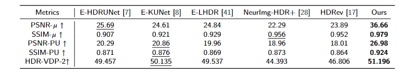

# Learning Event-based HDR Imaging in Real-world Scenarios
Single-exposure High Dynamic Range Imaging (HDRI), as a typical ill-posed problem, has attracted extensive attention from researchers. However, restoration in real-world scenarios has always been an intractable task due to various exposed regions and noise. In this paper, we propose an event-based HDRI model to implement the generalization in real-world scenes by utilizing the high dynamic range of events. Specifically, we proposed an exposure-aware framework with an exposure attention fusion module, which enables the effective fusion of image features and event features in different exposed regions. Moreover, taking into account the presence of noise in extremely exposed regions and events, we introduce a self-supervised loss based on the structure prior to effectively enhance the details of saturated areas while simultaneously decreasing noise. To evaluate our proposed method, we conduct a novel event-based HDRI benchmark dataset that contains both synthetic and real data, encompassing diverse exposed images. Comprehensive experiments have demonstrated that our method outperforms the state-of-the-art.

<center>
<div style="color:orange; border-bottom: 1px solid #d9d9d9;
    display: inline-block;
    color: #000;
    padding: 2px;">
      Quantitative comparisons on EBL2SH-SE
  	</div>
    
    <br>
</center>
<center>
<div style="color:orange; border-bottom: 1px solid #d9d9d9;
    display: inline-block;
    color: #000;
    padding: 2px;">
      Qualitative comparisons on EBL2SH-SE
  	</div>
    
    <br>
</center>

## Environment setup
- Python 3.8.13
- Pytorch 2.0.0
- NVIDIA GPU + CUDA 11.7
  
You can create a new [Anaconda](https://www.anaconda.com/products/individual) environment as follows.
<br>
Clone this repository.
```
git clone https://github.com/lixiaopeng123456/EHDRI.git
```
Install the above dependencies.
```
cd EHDRI
conda env create -f EHDRI.yaml
```

## Event-baed HDRI Dataset Benchmark
[The datasets](https://drive.google.com/drive/folders/) can be downloaded via Google Drive.
<br>
The EHDRI Dataset contains three datasets:
- **EHDRI-S** contains HDR-LDR image pairs from Kalantari13, HDM-HDR-2014, and DeepHDRVideo. These datasets contain paired LDR-HDR video sequences which can be leveraged to synthesize events. We utilize the ESIM simulator \cite{rebecq2018esim} to synthesize concurrent events.
- **EBL2SH-SE** contains aligned real-world LDR images, HDR image, and real-world event streams, which are captured by FLIR BFS-U3-32S4 camera and SilkyEvCam event camera.
- **EBL2SH-DV** contains aligned real-world LDR images, HDR image, and real-world event streams, which are captured by FLIR BFS-U3-04S2 camera and Davis346 event camera.

## Quick start
### Data preparation
Download the EBL2SH-SE to directory './Dataset/'
### Test
```
conda activate EHDRI
bash test.sh
```
